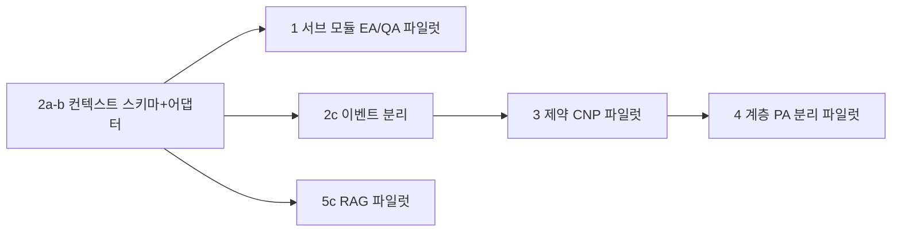

# 제조 MAS 고도화 로드맵 (계획안)

> 목적: 아래 5가지 방향을 **순차적으로 구현 가능한 작업 단위**로 쪼개고, 의존 관계와 현재 코드베이스와의 연결을 명확히 한다.  
> 철학: **규칙·솔버·제약이 결정을 고정**하고, **LLM은 설명·지식 인터페이스** — 기존 `MAS_SYSTEM_REFERENCE.md` / 라우터 설계와 충돌하지 않게 유지한다.

---

## 0. 한 줄 결론: 구현 가능한가?

**가능하다.** 다만 한 번에 전부가 아니라, **데이터 모델·컨텍스트 표준화(기반) → 서브 에이전트 분해 → 제약 협상 → 계층 오케스트레이션 → LLM 지식 레이어** 순으로 가는 것이 리스크가 가장 낮다.

| 방향 | 난이도 | 선행 조건 |
|------|--------|-----------|
| 1. 업무 단위 서브 에이전트 | 중 | 공통 컨텍스트(2)의 최소 스키마, 에이전트 런타임에서 “서브 단위 스케줄/상태” |
| 2. 표준 제조 컨텍스트 | 중~상 | `plant_data_model` 확장, 스냅샷 ↔ 이벤트 스트림 분리 설계 |
| 3. 제약 기반 협상 | 상 | 수학적 제약 정의, 솔버 인터페이스, CNP 입력 스키마 확장 |
| 4. 계층형 오케스트레이션 | 상 | 3번과 연동, PA 역할 분할 및 메시지 프로토콜 |
| 5. LLM 운영 지식 인터페이스 | 중 | RAG/문서 저장소, 감사 로그, 기존 “비제어” 원칙 유지 |

---

## 1. 방향 1 — “부서 에이전트” → “업무 단위 서브 에이전트”

### 1.1 현재 상태

- EA~PA **6역할** + `multi_agent_teams` / `agent_domain_registry` 로 **문서·대시보드 상 “서브 역할”** 이 이미 정의됨.
- **실제 판단 루프**는 여전히 **에이전트 클래스 1개 = 한 프로세스** 에 가깝고, 서브는 주로 **표시·메타** 수준.

### 1.2 목표

- 예시대로 **EA** → 이상 감지 / RUL / 예방정비 추천 / 공정조건 최적화 등 **독립 “판단 단위”**로 쪼갬.
- **QA** → SPC 감시, 비전, 원인 추정, 확산 차단 등 동일.

### 1.3 구현 관점에서의 선택지

| 접근 | 설명 | 장단점 |
|------|------|--------|
| **A. 한 클래스 내부 모듈화** | `EquipmentAgent` 안에 `AnomalyModule`, `RulModule`, … | 빠름, 기존 브로커·스레드 유지. “에이전트” 수는 여전히 1. |
| **B. 서브 에이전트 = 경량 객체 + 단일 EA “페더레이션”** | EA가 서브들의 Sense/Reason 결과를 합성 후 Act 1회 | 멀티 에이전트 느낌에 가깝고, 메시지는 내부 호출로 시작 가능. |
| **C. 서브 = 별 브로커 등록 ID** | `EA-AD`, `EA-RUL` … 실제 메시지 타깃 | 확장성 최대, 프로토콜·디버깅 부담 증가. |

**권장 순서:** **A → B** 로 시작해, 운영 요구가 생기면 **C** 로 일부만 분리.

### 1.4 작업 패키지 (예시)

1. **역할 매트릭스 문서화** — EA/QA별 서브 목록, 입력/출력, 누가 “최종 Act” 하는지.
2. **`BaseAgent` 또는 EA/QA 전용 베이스**에 `SubAgent` 인터페이스 (`sense_sub`, `reason_sub`, 우선순위 규칙).
3. 스냅샷에서 **서브가 필요로 하는 필드만** 뽑는 **뷰 함수** (컨텍스트 표준화(2)와 함께 가면 효과 큼).
4. 대시보드/API는 기존 `multi_agent_teams` 를 **“실행 중 서브 상태”** 와 연결할지 결정 (점진적).

---

## 2. 방향 2 — 공통 스냅샷 → “표준화된 제조 컨텍스트”

### 2.1 현재 상태

- `Factory.get_snapshot()` 중심의 **딕셔너리**.
- `plant_data_model` 에 `site_id`, `line_id`, `resource_id`, `tag_id` 등 **현장 연동을 염두에 둔 메타** 존재.

### 2.2 목표

- 설비·공정·품번·주문·작업지시·LOT·검사 결과를 **동일 키 체계**로 묶기.
- **시간 축** 통일 (시뮬 시각 vs 실제 UTC 모드).
- **이벤트 로그** vs **상태 스냅샷** 분리.
- KPI **집계 단위** 명시 (공정 / 설비 / 품번 / 시프트).

### 2.3 구현 단계 (권장)

| 단계 | 내용 |
|------|------|
| **2a. 스키마 명세** | Pydantic 또는 TypedDict 로 `ManufacturingContext` 초안: `identifiers`, `temporal`, `state`, `events_cursor`, `kpi_slices`. |
| **2b. 어댑터** | `get_snapshot()` → `ManufacturingContext` 변환 레이어 (시뮬은 그대로 두고 매핑만). |
| **2c. 이벤트** | `factory_tick` 외에 “의미 있는 비즈니스 이벤트”(작업 시작/완료, 검사 판정)를 별 큐 또는 테이블로 (메모리 → 나중에 DB). |
| **2d. 외부 연동 자리** | OPC/MES 대비: `tag_id` ↔ 값 수집만 바꿔 끼울 수 있게 인터페이스 고정. |

### 2.4 AAS/MES/ERP 방향과의 관계

- **지금:** 시뮬 상태 공유.
- **목표:** 동일 스키마로 **에이전트 입력만 바꿔** 실데이터를 넣을 수 있게 하는 것이 1차 목표. ERP 전면 연동은 별 프로젝트로 두고, **컨텍스트 계약**부터 고정하는 것이 합리적.

---

## 3. 방향 3 — 의견 교환 CNP → “제약 기반 협상”

### 2.1 현재 상태

- CNP로 제안 수집 → **솔버가 수치·전략 고정**, LLM은 근거 보강 — 문서와 코드 방향이 이미 **바람직한 출발점**.

### 3.2 목표

- 협상 입력에 **가용성, 공정 호환, 자재, 교대, 셋업, 납기 패널티, 품질 리스크 비용** 등 **하드/소프트 제약** 포함.
- 목적함수: “설득력”이 아니라 **기대 비용·위반 페널티 최소** (또는 가중 목표).

### 3.3 구현 패키지

1. **제약 온톨로지** — 변수(이산/연속), 제약 유형(등식/부등식), 위반 페널티 계수를 설정 파일 또는 DB로.
2. **CFP 페이로드 확장** — 제안이 “의견 텍스트”가 아니라 `(후보 행동, 예상 비용, 제약 위반량)` 구조.
3. **솔버 모듈** — 기존 `optimization_engine` / PlanningAgent 내 솔버와 통합: MILP/휴리스틱/규칙 기반 중 선택 (규모에 맞게).
4. **LLM 역할 고정** — 수치 변경 금지, **제약 해석·설명·대안 나열**만.

### 3.4 리스크

- 제약이 늘수록 **데이터 정합성** 요구가 커짐 → **방향 2(컨텍스트)** 가 선행되면 안전.

---

## 4. 방향 4 — 단일 PA → 계층형 오케스트레이션

### 4.1 현재 상태

- PA가 CNP 주관 + 라인 속도 등 **중앙 조정**에 가깝게 동작.

### 4.2 목표

- **Local** — 설비/품질/자재/재고 인접 결정.
- **Cell/Line Coordinator** — 공정군·라인 단위 트레이드오프.
- **Plant Orchestrator** — 납기·생산량·KPI 균형.

### 4.3 구현 패키지

1. **의사결정 범위 표** — 어떤 변수는 Local 만, 어떤 건 상승 승인 필요한지.
2. **메시지/프로토콜** — `Intent` 확장 또는 상위 전용 토픽 (`LINE_COORD`, `PLANT_ORCH`).
3. **런타임** — 스레드 모델: 상위는 저빈도 틱, 하위는 고빈도 (기존 `AGENT_INTERVALS` 확장).
4. **충돌 해소** — 동일 자원에 대한 동시 요청 시 규칙 (우선순위, 타임스탬프).

### 4.4 의존성

- **제약 기반 협상(3)** 과 자연스럽게 맞물림: 상위는 제약·목표 가중, 하위는 국소 실행.

---

## 5. 방향 5 — LLM을 “운영 지식 인터페이스”로

### 5.1 유지할 것 (불변)

- **라우터·인터록·솔버 우선**, LLM은 **직접 설비 제어 없음** — 현 문서·코드 원칙 유지.

### 5.2 확장 기능 (단계)

| 순서 | 기능 | 필요한 것 |
|------|------|-----------|
| 5a | 상황·KPI 연결 설명 | 이미 있는 스냅샷 + `ThinkResult` 로그 정리 |
| 5b | 다중 에이전트 판단 **통합 요약** | 에이전트 출력 표준 JSON |
| 5c | SOP/매뉴얼·정비 이력 기반 권장 | **문서 저장소 + RAG**, 출처 인용 |
| 5d | 이상 시 **회의용 리포트** | 템플릿 + 동일 스냅샷/이벤트 |

### 5.3 운영 요구

- **감사 로그** (누가·언제·어떤 프롬프트·어떤 컨텍스트).
- 환각 방지: **답변은 항상 근거 필드 참조** (지금 `monitoring_qa` 방향과 일치).

---

## 6. 권장 실행 순서 (로드맵)

1. **Phase A — 컨텍스트 (2a–2b)**  
   스냅샷을 깨지 않고 `ManufacturingContext` 어댑터 + 문서화.

2. **Phase B — 서브 에이전트 파일럿 (1)**  
   **EA 또는 QA 한 축만** 내부 모듈화(A/B) + 단일 진입 Act.

3. **Phase C — 이벤트·KPI 단위 (2c 일부)**  
   시뮬 내에서라도 “이벤트 vs 상태” 분리 패턴 확립.

4. **Phase D — 제약 협상 최소 버전 (3)**  
   납기·자재 2~3개 제약만 넣은 CFP/솔버 실험.

5. **Phase E — 계층 오케스트레이션 (4)**  
   Line Coordinator 하나 추가하는 **최소 2계층** 실험.

6. **Phase F — LLM 지식 (5)**  
   RAG는 인프라 준비 후, 설명·리포트부터.

---

## 7. 이 저장소에서 바로 잡을 “다음 스프린트” 후보 (짧게)

- [x] `ManufacturingContext` — **`mas/domain/manufacturing_context.py`** + `from_factory_snapshot(snap)` 어댑터. `/api/monitoring` 에 `manufacturing_context` 키로 포함.  
- [x] **EA 서브 모듈** — `mas/agents/equipment_sub/` (`anomaly`, `rul`), `get_agent_status["sub_agent_views"]` 에 **EA-AD / EA-RUL** 요약.  
- [x] **CNP `proposal_metrics`** — EA 제안에 `cost_estimate`, `constraint_violation_total`, `rul_worst_hours`. PA가 `total_score` 에 위반량 소량 페널티(0.05×) 반영.

---

## 8. 요약

| 질문 | 답 |
|------|-----|
| 구현 가능한가? | 예. 단계적으로. |
| 무엇이 먼저인가? | **표준 컨텍스트(2)** 와 **한 축 서브 분해(1)** 가 다른 작업의 발판. |
| CNP/솔버 철학을 바꿔야 하나? | 아니요. **제약·비용을 입력으로 넣고 솔버가 고정**하는 쪽으로 확장. |
| LLM을 키우면 위험하지 않나? | **제어 경로에 넣지 않고**, RAG·설명·리포트로만 확장하면 기존 철학과 호환. |

---

*본 문서는 계획안이며, 승인 후 이슈/마일스톤으로 쪼개면 됩니다.*
