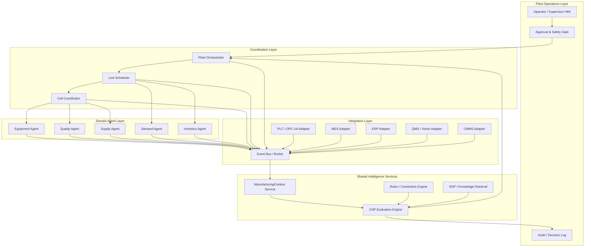
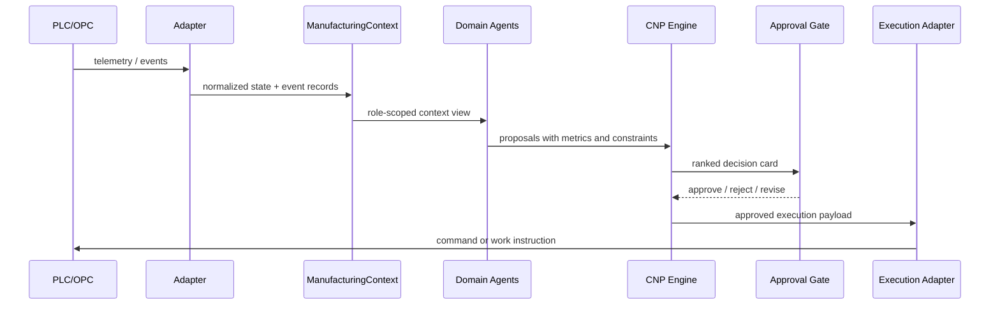

# Target Manufacturing Architecture

## Goal

Move the current simulation-first MAS into a manufacturing-operable architecture with:

- standardized plant context contracts
- layered coordination instead of a single central planner
- explicit decision authority and approval boundaries
- adapter-first integration with MES, ERP, QMS, CMMS, and shop-floor data
- replayable event history and auditable CNP decisions

## Target Operating Model



## Decision Boundaries

- Domain agents recommend actions inside their scope.
- Coordinators resolve local conflicts and generate ranked proposals.
- The planner/orchestrator selects a candidate plan, but high-risk actions require approval.
- Only the execution layer applies approved actions to external systems.

## Standard Data Flow



## Target Folder Structure

```text
mas/
  core/
    config.py
    logging_config.py
    manufacturing_ids.py
  contracts/
    manufacturing_context.py
    cnp_models.py
    decision_card.py
    events.py
  domain/
    environment.py
    machines.py
    production.py
    inventory.py
  agents/
    equipment_agent.py
    quality_agent.py
    supply_agent.py
    demand_agent.py
    inventory_agent.py
    planning_agent.py
    planning_sub/
      alert_collector.py
      proposal_evaluator.py
      proposal_ranker.py
      strategy_reporter.py
      execution_planner.py
  coordination/
    plant_orchestrator.py
    line_scheduler.py
    cell_coordinator.py
  messaging/
    broker.py
    message.py
    topics.py
  runtime/
    factory_runtime.py
    scenario_runtime.py
  integration/
    opc_adapter.py
    mes_adapter.py
    erp_adapter.py
    qms_adapter.py
    cmms_adapter.py
  intelligence/
    decision_router.py
    llm.py
    optimization_engine.py
    monitoring_qa.py
  api/
    server.py
    static/
tests/
  contracts/
  cnp/
  runtime/
  integration/
docs/
```

## Mapping From Current Code

- `mas/domain/manufacturing_context.py` becomes the system contract source.
- `mas/agents/planning_agent.py` becomes a thin orchestrator over planning submodules.
- `mas/agents/planning_sub/*` becomes the real CNP engine surface.
- `mas/adapters/base.py` evolves into concrete integration adapters.
- `mas/runtime/factory_runtime.py` remains the simulator runtime, but must consume standardized contracts.

